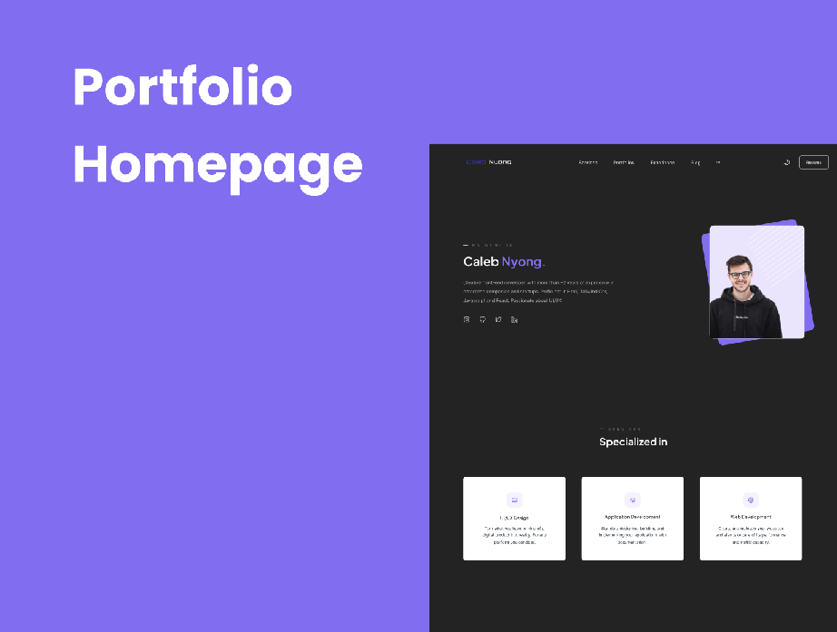

<h1 align="center">Protfolio Homepage</h1>

Esse projeto foi desenvolvido em partipação com o desenvolvedor Front-End - <a href="https://github.com/Volaxy">Gustavo</a> 

  <a href="#-tecnologias">Tecnologias</a>&nbsp;&nbsp;&nbsp;|&nbsp;&nbsp;&nbsp;
  <a href="#-projeto">Projeto</a>&nbsp;&nbsp;&nbsp;|&nbsp;&nbsp;&nbsp;
  <a href="#memo-licença">Dupla</a>

 

  

## 🚀 Tecnologias

Esse projeto foi desenvolvido com as seguintes tecnologias:

- HTML e CSS
- Git e Github
- Figma

## 💻 Projeto

Acesse agora o [figma](https://www.figma.com/file/minJXIxmuDa8zfTwx5UbZ4/Portfolio-Web-Template-(Community)-(Community)?node-id=0%3A1&t=5qqwTM5nZI5N2x5U-0) para obter o template do projeto.

---